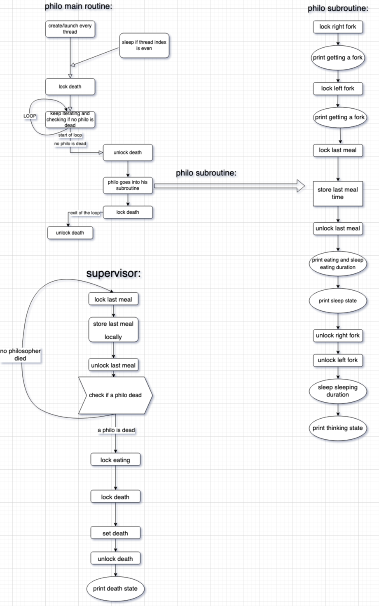

# philosophers
## a better approach to the dinning philosophers problem
Knock knock \
Who's there?\
Race condition who?\
Race condition.

## how to use:
1. make re
2. ./philo arg1 arg2 arg3 arg4 (arg5)

arg1 = number_of_philosophers\
arg2 = time_to_die\
arg3 = time_to_eat\
arg4 = time_to_sleep\
arg5 = number_of_times_each_philosopher_must_eat (optional)
